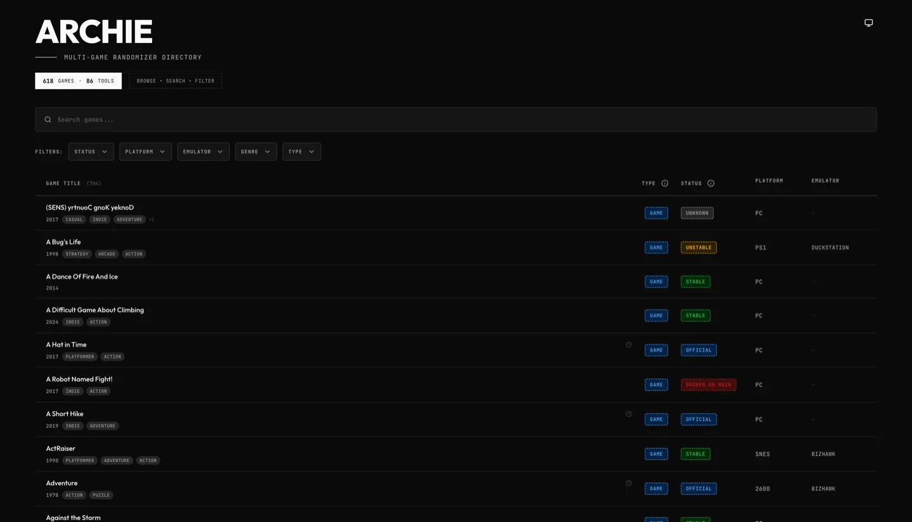

# ARCHIE — Archipelago Game Directory

**Browse and discover every game supported by the [Archipelago](https://archipelago.gg) multi-game randomizer.**

**[archie-search.vercel.app](https://archie-search.vercel.app/)**

---



---

## What is ARCHIE?

[Archipelago](https://archipelago.gg) is a multi-game randomizer platform that lets players share items across games in the same session. ARCHIE is a community-maintained directory that helps you find which games are supported, check their status, and see what platforms and emulators they require — all in one searchable place.

## Features

- **Find games instantly** — search by name, status, platform, or emulator requirement
- **Filter by what matters** — narrow down by support status (Stable, Official, Unstable, and more), platform, or emulator
- **See the full picture** — genre, release year, and support status on every game card
- **Works on any device** — mobile, tablet, and desktop layouts
- **Keyboard accessible** — full keyboard navigation and screen reader support

## Getting Started

**Prerequisites:** Node.js v22+ and pnpm v10+

```bash
pnpm install
pnpm dev
```

Open [http://localhost:3000](http://localhost:3000).

```bash
pnpm test    # run unit tests
pnpm build   # production build (also regenerates game data)
```

## Contributing

Contributions are welcome — whether that's adding a new game, correcting data, or improving the app itself. See [CONTRIBUTING.md](CONTRIBUTING.md) to get started.

## Data

Game data comes from the community-maintained Archipelago master game list, enriched with genre and release date information from the RAWG API. Data is processed at build time.

## Links

- [archipelago.gg](https://archipelago.gg) — the Archipelago project
- [Archipelago GitHub](https://github.com/ArchipelagoMW/Archipelago) — source and APWorlds
- [Contributing guide](CONTRIBUTING.md)
- [Code of Conduct](CODE_OF_CONDUCT.md)
